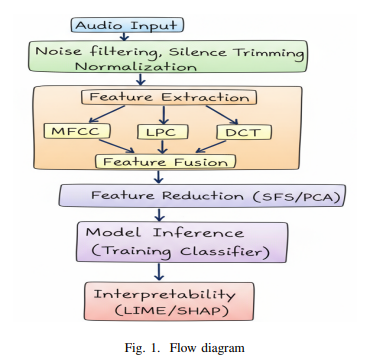
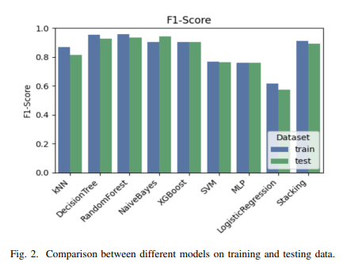
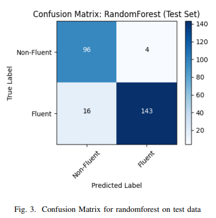
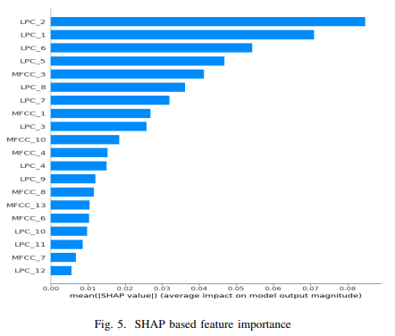
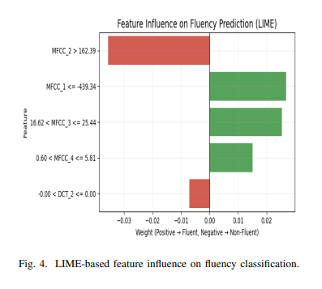
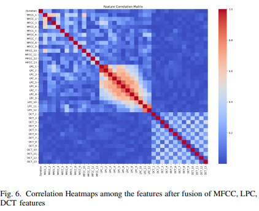

# 🎙️ Fluency Analysis of Students Viva from Voice Signals

<div align="center">

### 🧠 Explainable Machine Learning for Automated Speech Fluency Assessment

<p>
  
  
  
  
  
</p>

**MFCC + LPC + DCT Feature Fusion • Machine Learning • Explainable AI**

</div>

---

## 📌 Overview

**Fluency Analysis of Students Viva from Voice Signals** is a machine learning project that automatically analyzes a student's viva voice recording and classifies the speech into two categories:

* 🟢 **Fluent**
* 🔴 **Non-Fluent**

The system processes speech recordings, extracts meaningful acoustic characteristics, performs feature fusion and optimization, and applies multiple machine learning models to predict speech fluency.

To improve the transparency of the predictions, the framework incorporates **Explainable AI (XAI)** techniques using **SHAP** and **LIME**.

### 🎯 Main Goal

> **Convert a student's viva voice recording into an automated and interpretable fluency prediction using acoustic signal processing and machine learning.**

---

# ✨ Key Features

| Feature                  | Description                                               |
| :----------------------- | :-------------------------------------------------------- |
| 🎙️ **Audio Processing** | Preprocessing of student speech recordings                |
| 🎵 **MFCC Extraction**   | Captures spectral characteristics of speech               |
| 📈 **LPC Extraction**    | Models speech and vocal-tract characteristics             |
| 📊 **DCT Extraction**    | Provides compact frequency-domain information             |
| 🧩 **Feature Fusion**    | Combines MFCC, LPC, and DCT features                      |
| 🔎 **Feature Selection** | Removes redundant and less informative features           |
| 📉 **PCA**               | Reduces dimensionality while retaining important variance |
| 🤖 **ML Classification** | Compares multiple machine learning models                 |
| 🔬 **SHAP**              | Provides global feature importance                        |
| 💡 **LIME**              | Explains individual predictions                           |

---

# 🧠 Methodology

The proposed system follows an end-to-end speech analysis and machine learning pipeline.

## Fig. 1 — Overall Flow Diagram

<div align="center">



<br>

<em>Fig. 1. Overall flow diagram of the proposed speech fluency analysis framework.</em>

</div>

### Overall Workflow

```text
🎙️ Student Viva Recording
             │
             ▼
┌────────────────────────────┐
│     Audio Preprocessing    │
│                            │
│  • Noise Reduction         │
│  • Silence Removal         │
│  • Normalization           │
└─────────────┬──────────────┘
              │
              ▼
┌────────────────────────────┐
│   Acoustic Feature         │
│       Extraction           │
│                            │
│  • MFCC                    │
│  • LPC                     │
│  • DCT                     │
└─────────────┬──────────────┘
              │
              ▼
┌────────────────────────────┐
│      Feature Fusion        │
│     38-Dimensional         │
│      Representation        │
└─────────────┬──────────────┘
              │
              ▼
┌────────────────────────────┐
│    Feature Optimization    │
│                            │
│  • Correlation Filtering   │
│  • Sequential Feature      │
│    Selection (SFS)         │
│  • PCA                     │
└─────────────┬──────────────┘
              │
              ▼
┌────────────────────────────┐
│     ML Classification      │
│                            │
│  • Random Forest           │
│  • Decision Tree            │
│  • SVM                     │
│  • kNN                     │
│  • XGBoost                 │
│  • Naive Bayes             │
│  • Logistic Regression     │
│  • MLP                     │
│  • Stacking                │
└─────────────┬──────────────┘
              │
              ▼
       🎯 Fluency Prediction
              │
       ┌──────┴──────┐
       ▼             ▼
 🟢 FLUENT      🔴 NON-FLUENT
       │
       ▼
   🔍 SHAP + LIME
   Explain Prediction
```

---

# 🎧 Acoustic Feature Extraction

The framework combines three complementary acoustic feature representations.

## 🎵 MFCC

**Mel-Frequency Cepstral Coefficients (MFCC)** capture perceptually important spectral characteristics of speech.

MFCC features are widely used in speech-processing applications because they represent the spectral envelope of speech in a compact form.

---

## 📈 LPC

**Linear Predictive Coding (LPC)** models characteristics of the speech production mechanism and contributes complementary information about speech characteristics.

---

## 📊 DCT

**Discrete Cosine Transform (DCT)** provides compact frequency-domain information and complements the MFCC and LPC representations.

---

## 🧩 Feature-Level Fusion

MFCC, LPC, and DCT features are combined using feature-level fusion to produce a:

> **38-dimensional acoustic feature representation**

This fused representation is subsequently processed through feature optimization techniques before classification.

---

# 🔬 Feature Engineering and Optimization

After feature extraction and fusion, the system performs feature optimization to reduce redundancy and improve the efficiency of the machine learning pipeline.

```text
38 Acoustic Features
        │
        ▼
Correlation Analysis
        │
        ▼
Remove Highly Correlated Features
        │
        ▼
Sequential Feature Selection (SFS)
        │
        ▼
Principal Component Analysis (PCA)
        │
        ▼
Retain 95% Variance
```

### Optimization Techniques

### 1. Correlation Analysis

Highly correlated features are analyzed to identify redundant information.

### 2. Sequential Feature Selection

**Sequential Feature Selection (SFS)** is used to identify a useful subset of features for classification.

### 3. Principal Component Analysis

**PCA** is applied to obtain a compact representation while retaining **95% of the variance**.

---

# 🤖 Machine Learning Models

The framework evaluates multiple machine learning algorithms.

| Model                      | Purpose                                 |
| :------------------------- | :-------------------------------------- |
| 🌲 **Random Forest**       | Ensemble tree-based classification      |
| 🌳 **Decision Tree**       | Interpretable tree-based classification |
| 📍 **kNN**                 | Distance-based classification           |
| 📐 **SVM**                 | Margin-based classification             |
| ⚡ **XGBoost**              | Gradient boosting classification        |
| 🧮 **Naive Bayes**         | Probabilistic classification            |
| 📊 **Logistic Regression** | Linear classification                   |
| 🧠 **MLP**                 | Neural-network-based classification     |
| 🔗 **Stacking**            | Ensemble of multiple classifiers        |

---

# 🏆 Results

The models were evaluated using:

* Accuracy
* Precision
* Recall
* F1-Score
* Confusion Matrix

---

## Table I — Best F1-Scores and Hyperparameters for Tuned Models

| Model               | Best F1-Score | Hyperparameter Values                                                                                                       |
| :------------------ | ------------: | :-------------------------------------------------------------------------------------------------------------------------- |
| kNN                 |     **0.736** | `{k: 3}`                                                                                                                    |
| Decision Tree       |     **0.864** | `{max_depth: 5, min_samples_split: 10}`                                                                                     |
| **Random Forest**   |     **0.898** | `{n_estimators: 5, max_depth: 3, min_samples_split: 5}`                                                                     |
| Naive Bayes         |     **0.861** | `{}`                                                                                                                        |
| XGBoost             |     **0.859** | `{n_estimators: 5, learning_rate: 0.05, max_depth: 3}`                                                                      |
| SVM                 |     **0.760** | `{hidden_size: 5, lr: 0.01, n_iters: 500}`                                                                                  |
| Logistic Regression |     **0.757** | `{lr: 0.01, n_iters: 500}`                                                                                                  |
| Stacking            |     **0.864** | `{base_models_params_list: [{lr: 0.01, n_iters: 1000}, {max_depth: 5, k: 5}], meta_model_params: {lr: 0.05, n_iters: 500}}` |

**Table I.** Best F1-scores and hyperparameter values obtained during model tuning.

> **Note:** The F1-scores in Table I represent the best scores obtained during model tuning and are distinct from the final test-set F1-scores reported in Table II.

---

## Table II — Performance of Different Models

| Model                   | Dataset |  Accuracy | Precision |    Recall |  F1-Score |
| :---------------------- | :-----: | --------: | --------: | --------: | --------: |
| **kNN**                 |  Train  |     0.835 |     0.838 |     0.835 |     0.837 |
|                         |   Test  |     0.772 |     0.772 |     0.772 |     0.772 |
| **Decision Tree**       |  Train  |     0.943 |     0.943 |     0.943 |     0.943 |
|                         |   Test  |     0.911 |     0.911 |     0.911 |     0.911 |
| **Random Forest**       |  Train  | **0.981** | **0.981** | **0.981** | **0.981** |
|                         |   Test  | **0.942** | **0.942** | **0.942** | **0.942** |
| **Naive Bayes**         |  Train  |     0.927 |     0.927 |     0.927 |     0.927 |
|                         |   Test  |     0.927 |     0.927 |     0.927 |     0.927 |
| **XGBoost**             |  Train  |     0.859 |     0.859 |     0.859 |     0.859 |
|                         |   Test  |     0.828 |     0.828 |     0.828 |     0.828 |
| **SVM**                 |  Train  |     0.628 |     0.908 |     0.625 |     0.758 |
|                         |   Test  |     0.747 |     0.895 |     0.740 |     0.810 |
| **MLP**                 |  Train  |     0.751 |     0.820 |     0.784 |     0.780 |
|                         |   Test  |     0.721 |     0.819 |     0.780 |     0.799 |
| **Logistic Regression** |  Train  |     0.644 |     0.712 |     0.657 |     0.683 |
|                         |   Test  |     0.622 |     0.771 |     0.611 |     0.683 |
| **Stacking**            |  Train  |     0.884 |     0.890 |     0.884 |     0.887 |
|                         |   Test  |     0.853 |     0.890 |     0.853 |     0.860 |

**Table II.** Performance comparison of different machine learning models on training and testing data.

---

## 🥇 Best Test Performance

The **Random Forest** model achieved the strongest reported test-set performance.

| Metric        | Random Forest |
| :------------ | ------------: |
| **Accuracy**  |     **0.942** |
| **Precision** |     **0.942** |
| **Recall**    |     **0.942** |
| **F1-Score**  |     **0.942** |

Random Forest achieved **94.2% accuracy**, **94.2% precision**, **94.2% recall**, and an **F1-score of 0.942** on the test dataset.

---

# 📊 Fig. 2 — Model Performance Comparison

<div align="center">



<br>

<em>Fig. 2. Comparison between different models on training and testing data.</em>

</div>

The figure compares the F1-scores of the evaluated models on training and testing datasets.

Random Forest provides the strongest reported test performance among the evaluated models.

---

# 🔲 Fig. 3 — Random Forest Confusion Matrix

<div align="center">



<br>

<em>Fig. 3. Confusion matrix for Random Forest on test data.</em>

</div>

### Confusion Matrix Results

| Actual Class | Predicted Class | Number of Samples |
| :----------- | :-------------- | ----------------: |
| Non-Fluent   | Non-Fluent      |            **96** |
| Non-Fluent   | Fluent          |             **4** |
| Fluent       | Non-Fluent      |            **16** |
| Fluent       | Fluent          |           **143** |

The displayed confusion matrix contains **239 correct classifications** and **20 misclassifications**.

---

# 🔍 Explainable Artificial Intelligence

A key component of the project is **Explainable AI (XAI)**.

Traditional machine learning models may provide only a final prediction, such as:

```text
Prediction: Fluent
```

The proposed framework goes further by providing information about the acoustic features influencing the prediction.

Two explanation techniques are used:

* 🔬 **SHAP** — Global feature importance
* 💡 **LIME** — Local feature explanation

---

# 🔬 Fig. 5 — SHAP-Based Feature Importance

<div align="center">



<br>

<em>Fig. 5. SHAP-based feature importance.</em>

</div>

**SHAP (SHapley Additive exPlanations)** is used to understand the contribution of acoustic features to the model's predictions.

The SHAP analysis provides a global view of feature importance and helps identify which extracted acoustic characteristics have a greater influence on fluency classification.

---

# 💡 Fig. 4 — LIME-Based Feature Influence

<div align="center">



<br>

<em>Fig. 4. LIME-based feature influence on fluency classification.</em>

</div>

**LIME (Local Interpretable Model-Agnostic Explanations)** is used to explain individual predictions.

The visualization shows how different feature conditions contribute positively or negatively to the predicted fluency class.

This provides a local explanation of why a particular speech sample receives its predicted classification.

---

# 🔥 Fig. 6 — Correlation Heatmaps After Feature Fusion

<div align="center">



<br>

<em>Fig. 6. Correlation heatmaps among the features after fusion of MFCC, LPC, and DCT features.</em>

</div>

The correlation heatmaps visualize relationships among the fused **MFCC, LPC, and DCT** features.

This analysis supports the correlation-based feature optimization stage by identifying relationships and potential redundancy among the extracted acoustic features.

---

# 📚 Dataset

The project uses student viva speech recordings labelled into two classes:

### 🟢 Fluent

Smooth and relatively consistent speech.

### 🔴 Non-Fluent

Speech exhibiting lower fluency characteristics.

## Dataset Information

| Property                 | Details                 |
| :----------------------- | :---------------------- |
| 🎙️ Number of recordings | **1300**                |
| ⏱️ Recording duration    | **10–40 seconds**       |
| 🎚️ Sampling rate        | **16 kHz**              |
| 📁 Format                | **WAV**                 |
| 🏷️ Classes              | **Fluent / Non-Fluent** |
| ⚖️ Class balancing       | **SMOTE**               |

> ⚠️ **Privacy:** Raw student recordings are not included in the public repository. The repository contains processed feature data where applicable.

---

# 🛠️ Technology Stack

| Technology              | Purpose                |
| :---------------------- | :--------------------- |
| 🐍 **Python**           | Core development       |
| 🎧 **Librosa**          | Audio processing       |
| 🔢 **NumPy**            | Numerical computing    |
| 🐼 **Pandas**           | Data processing        |
| 🤖 **Scikit-learn**     | Machine learning       |
| ⚡ **XGBoost**           | Gradient boosting      |
| 🔬 **SHAP**             | Global explainability  |
| 💡 **LIME**             | Local interpretability |
| 📓 **Jupyter Notebook** | Experimentation        |

---


# 🚀 Installation

## 1. Clone the Repository

```bash
git clone <YOUR-GITHUB-REPOSITORY-URL>
cd Fluency-Analysis-of-Students-Viva
```

## 2. Create a Virtual Environment

```bash
python -m venv venv
```

## 3. Activate the Environment

### Windows

```bash
venv\Scripts\activate
```

### Linux / macOS

```bash
source venv/bin/activate
```

## 4. Install Dependencies

```bash
pip install -r requirements.txt
```

---

# ▶️ Usage

The general workflow of the project is:

```text
🎙️ Audio File
      │
      ▼
Audio Preprocessing
      │
      ▼
MFCC + LPC + DCT Extraction
      │
      ▼
Feature Fusion
      │
      ▼
Feature Optimization
      │
      ▼
Machine Learning Model
      │
      ▼
Fluent / Non-Fluent
      │
      ▼
SHAP + LIME Explanation
```

The project can be executed using the provided Jupyter Notebook or Python scripts.

---

# 📊 Model Evaluation

The performance of the models is evaluated using four primary classification metrics.

### Accuracy

Measures the proportion of correctly classified samples.

### Precision

Measures how many samples predicted as a particular class are actually members of that class.

### Recall

Measures how many samples belonging to a class are correctly identified.

### F1-Score

Provides the harmonic mean of precision and recall.

The confusion matrix is additionally used to analyze correct and incorrect predictions for the selected model.

---

# 💡 What Makes This Project Different?

<div align="center">

|           🎧 Audio-Based           | 🧩 Feature Fusion |           🤖 ML-Based          | 🔍 Explainable |
| :--------------------------------: | :---------------: | :----------------------------: | :------------: |
| Works directly with speech signals |  MFCC + LPC + DCT | Multiple classifiers evaluated |   SHAP + LIME  |

</div>

### 🎧 Audio-Based

The system works directly with student viva speech recordings.

### 🧩 Multi-Feature Fusion

The framework combines **MFCC, LPC, and DCT** features to capture complementary speech characteristics.

### 🤖 Multi-Model Evaluation

Nine different machine learning approaches are evaluated and compared.

### 🔍 Explainable

SHAP and LIME provide insight into the features influencing model predictions.

### 📊 Quantitative Evaluation

The project reports accuracy, precision, recall, F1-score, and confusion-matrix results.

---

# 🔮 Future Improvements

* 🎤 Real-time microphone-based fluency detection
* 🌐 Web-based fluency evaluation application
* 📱 Mobile application integration
* 🧠 Transformer-based speech representations
* 🌍 Multilingual and accent-aware evaluation
* 📈 Student fluency progress tracking
* 📊 Automated feedback generation
* 🎯 Continuous fluency scoring instead of binary classification

---

# 📜 Publication

<div align="center">

## 📄 Published IEEE Conference Paper

</div>

This project is based on the following published IEEE conference paper:

> **U. K. Kushal, K. M. Sai, R. Gnaneswar and P. B. Pati, "An Explainable Framework for Automated Speech Fluency Evaluation using Spectral Features with Statistical Classifiers," 2026 7th International Conference on Computational Intelligence and Networks (CINE), Bhubaneswar, India, 2026, pp. 1-6, doi: 10.1109/CINE68769.2026.11502875.**

<div align="center">

[](https://doi.org/10.1109/CINE68769.2026.11502875)

</div>

---

# ⭐ Support

If you found this project useful or interesting:

* ⭐ **Star** this repository
* 🍴 **Fork** the project
* 🐛 **Report** issues
* 💡 **Suggest** improvements

---

<div align="center">

### 🎙️ Speech → Features → Machine Learning → Explainable Prediction

**Built with Python • Machine Learning • Audio Processing • Explainable AI**

<br>

⭐ **Fluency Analysis of Students Viva from Voice Signals** ⭐

</div>

